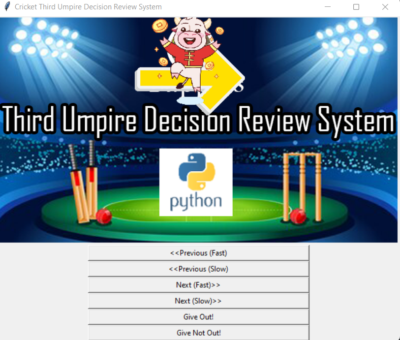
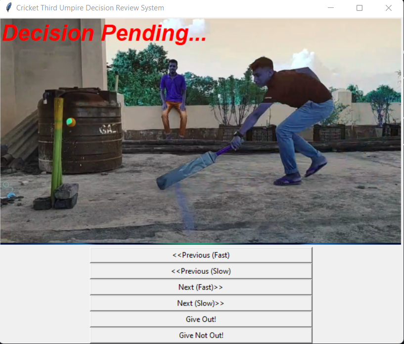
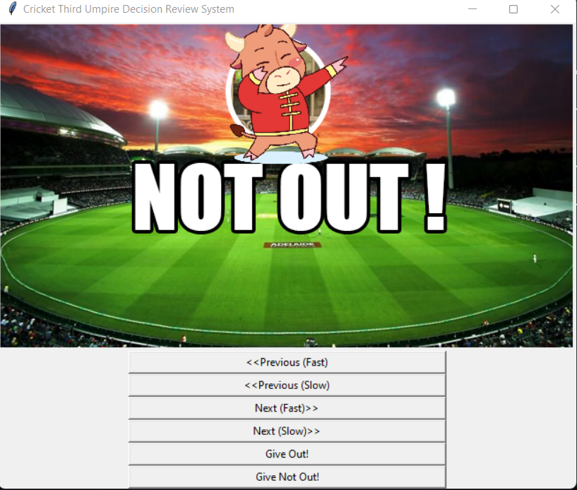

# Cricket-Third-Umpire-Decision-Review-System

The Decision Review System (DRS) is a technology-based process for assisting the match officials with their decision-making. On-field umpires may consult with the third umpire (an Umpire Review) and players may request that the third umpire consider a decision of the on-field umpires (a Player Review).



# How to run?
### STEPS:

Clone the repository

```bash
https://github.com/entbappy/Cricket-Third-Umpire-Decision-Review-System.git
```
### STEP 01- Create a conda environment after opening the repository

```bash
conda create -n review python=3.7.10 -y
```

```bash
conda activate review
```


### STEP 02- install the requirements
```bash
pip install -r requirements.txt
```

### STEP 03- run app.py
```bash
python app.py
```

```bash
Note: update your video clip name inside config/config.yaml & keep your video clip in templates/clips folder
```


# Demo:





## Built With

1. opencv-python 
2. Python
3. tkinter


## Authors
iNeuron Private limited
## License

This project is licensed under the MIT License - see the [LICENSE.md](LICENSE.md) file for details
